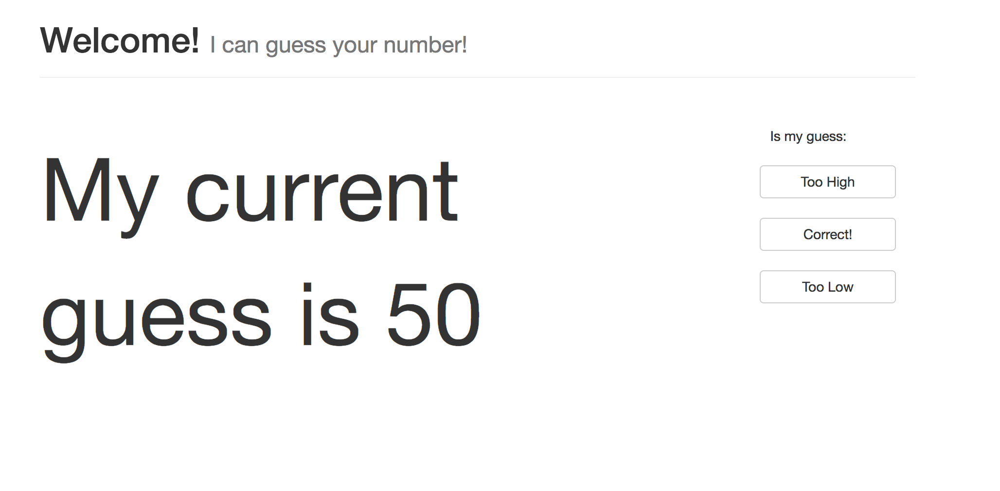

# The Iron Yard Crash Course

## Steps

1. Install [Atom.io](https://atom.io/) or Visual Studio Code
2. Download and upload this code
3. Download NodeJS from https://nodejs.org/en/download/
4. Unzip and open with Atom
4. In terminal, run `npm install` and then run node with `npm start`

## Goals

* Implement the routes to adjust min, max, and currentGuess based on the
  existing buttons
* When computer guesses your number, change `correct` to true

## Things we'll cover

1. Variable Assignment
2. Node Routing
3. Conditionals
